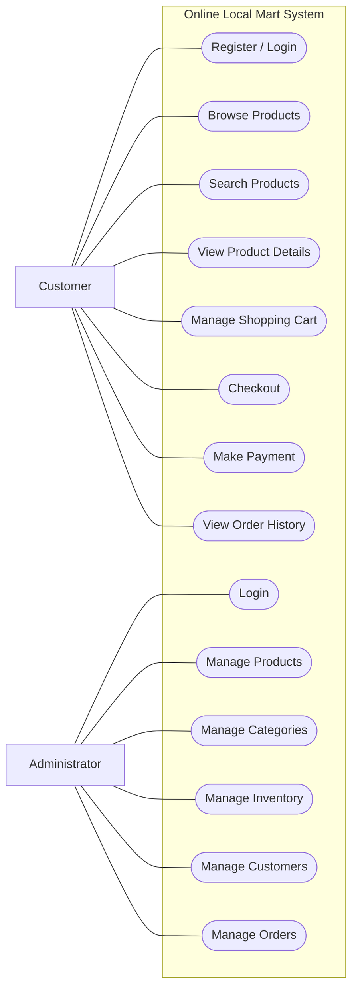
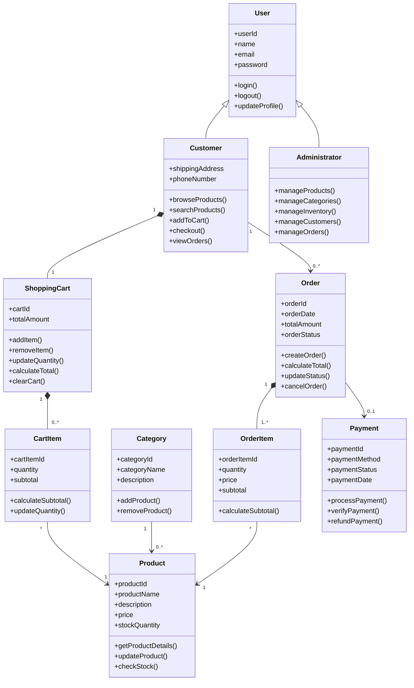

# GROUP4_CSEB5223_OLMS
Online Local Mart System - CSEB5223 Software Construction &amp; Methods
## 1. Construction Environment

### 1.1 System Type

The proposed system is a **web-based online shopping system**.

### 1.2 Proposed Technologies

| Component | Technology |
|---|---|
| Frontend | HTML, CSS, JavaScript |
| Backend | PHP |
| Database | MySQL |
| Version Control | GitHub |
| Development Environment | Web |

---

## 2. Use Case

## 3. Class Diagram

